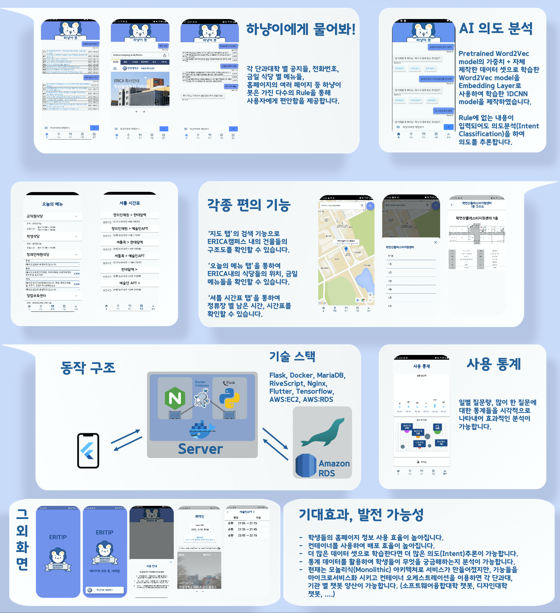

# ERITIP: 에리카의 모든 팁(Team. ERIA)

## Result

---

## 개요

한양대학교 ERICA 학교 홈페이지에 익숙하지 않은 신입생, 복학생, 편입생을 위한 각종 정보를 알려주는 챗봇

---

## 개발환경 및 툴

## 기능

- 챗봇(인사말, 각 단과대 공지, 금일 학식 메뉴, 전화번호, 페이지 안내 기능, 의도추론(단과대 공지) )
- 지도(검색, 건물 층별 구조도)
- 금일 학식표 확인
- 실시간 셔틀 시간표 확인
- 통계(일별 질문량, 질문 워드 클라우드)

---

## 업무 분담

- 강경원
    - 챗봇, 통계 페이지, 백엔드(본 깃허브에 없음)
- 정소빈
    - 지도 페이지, 학식 페이지
- 최지훈
    - 셔틀 페이지

---

## 버전

### **0.0.4 - 채팅창 오토스크롤 기능 추가, 맵 정상화, 채팅창에 * 안내 로 동작하는 인웹 컨테이너 추가**

### **0.0.5 - 안내 기능 추가, 네비게이션바 폰트 변경, 설정 페이지 수정, 셔틀 페이지 폰트 수정**

### **0.0.5.1 - 오타 수정**

### **0.0.5.2 - 스플래시, 로그인 이미지 업스케일**

### **0.0.6 - 서버 스펙으로 인하여 로컬(개인서버), AWS(배포서버)분류**

### **0.0.7 - 추론 업데이트, 셔틀,학식 디자인 변경**

### **0.0.8 - 통계 페이지 추가**

---
